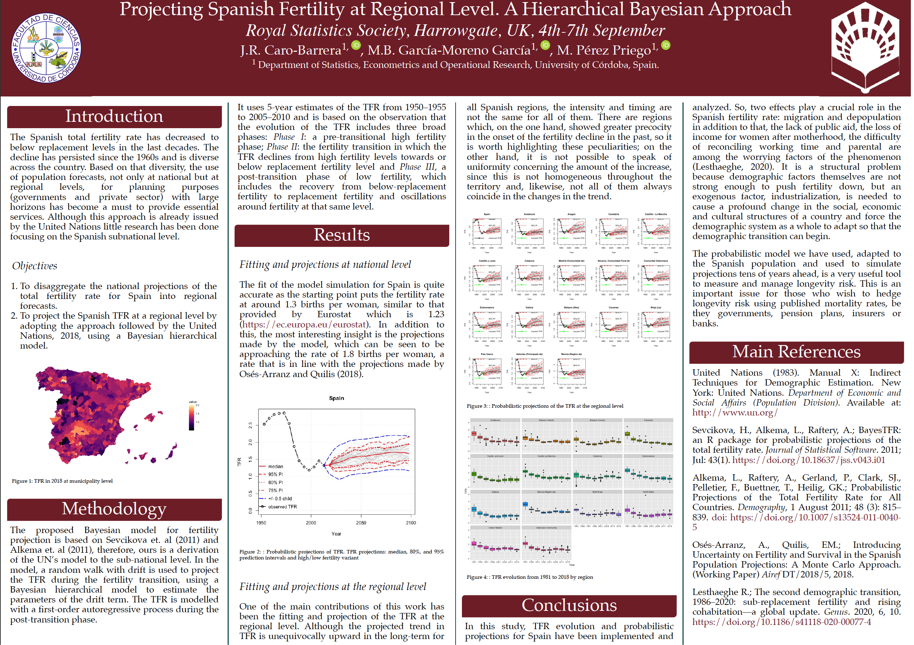

# Royal Statistics Society Congress Harrogate 2023

 The Spanish total fertility rate has decreased to below replacement levels in the last decades. The decline has persisted since the 1960s and is diverse across the country. Based on that diversity, the use of population forecasts, not only at national but at regional levels, for planning purposes (governments and private sector) with large horizons has become a must to provide essential services. Although this approach is already issued by the United Nations little research has been done focusing on the Spanish subnational level.

 [Download the paper](https://doi.org/10.1371/journal.pone.0275492)

