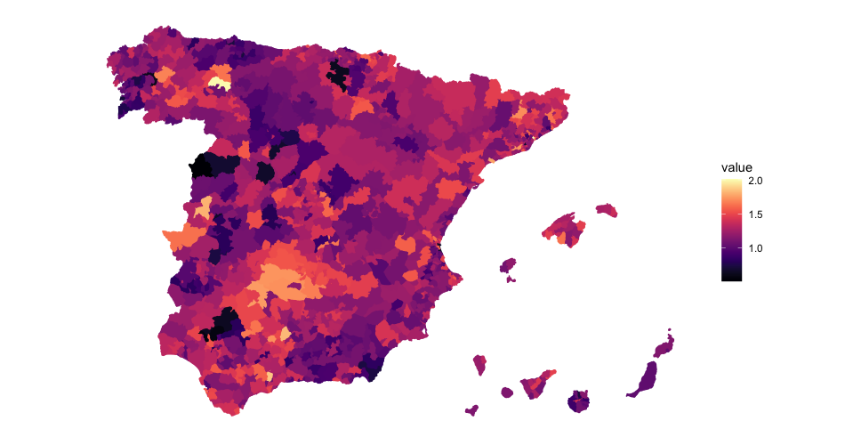
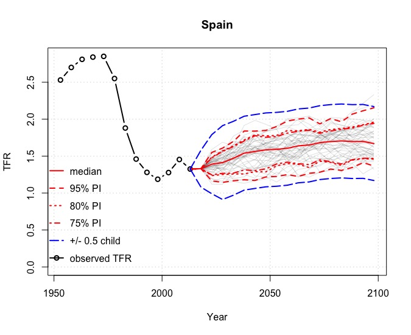
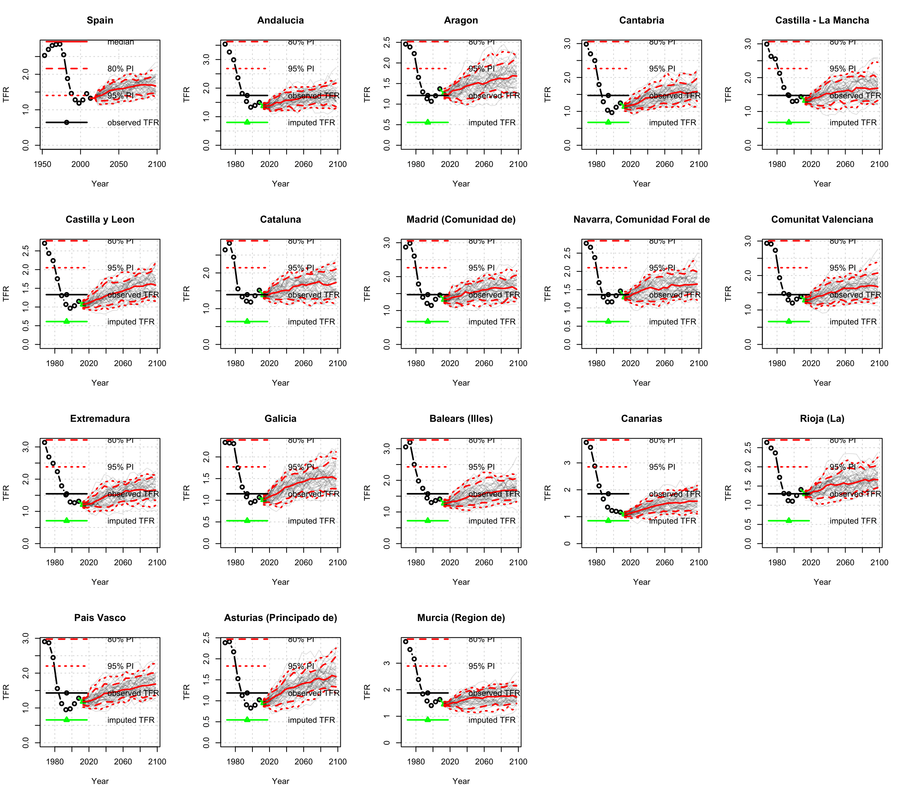
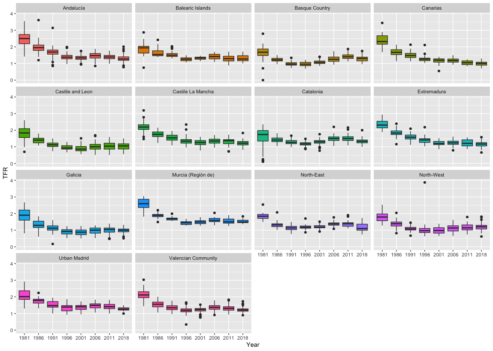

```{css, echo=FALSE}
.adjust-line-height {
  line-height: 1em;
}

div.title_container{
   background-color: #6d1d26;
}

div.logo_left{
  background-color: #6d1d26;
}

div.logo_right{
  background-color: #6d1d26;
}

div.sectitle_bgcol{
  background-color: #6d1d26;
}
```


```{r setup, include=FALSE}
knitr::opts_chunk$set(echo = FALSE)
```

# Introduction

The Spanish total fertility rate has decreased to below replacement levels in the last decades. The decline has persisted since the 1960s and is diverse across the country. Based on that diversity, the use of population forecasts, not only at national but at regional levels, for planning purposes (governments and private sector) with large horizons has become a must to provide essential services. Although this approach is already issued by the United Nations little research has been done focusing on the Spanish subnational level.

## *Objectives*

1. To disaggregate the national projections of the total fertility rate for Spain into regional forecasts.
2. To project the Spanish TFR at a regional level by adopting the approach followed by the United Nations, 2018, using a Bayesian hierarchical model.

```{r spain, echo=FALSE, fig.cap="TFR in 2018 at municipality level", out.width = '100%'}

```

# Methodology

The proposed Bayesian model for fertility projection is based on Sevcikova et. al (2011) and Alkema et. al (2011), therefore, ours is a derivation of the UN’s model to the sub-national level. In the model, a random walk with drift is used to project the TFR during the fertility transition, using a Bayesian hierarchical model to estimate the parameters of the drift term. The TFR is modelled with a first-order autoregressive process during the post-transition phase. 

It uses 5-year estimates of the TFR from 1950–1955 to 2005–2010 and is based on the observation that the evolution of the TFR includes three broad phases: *Phase I*: a pre-transitional high fertility phase; *Phase II*: the fertility transition in which the TFR declines from high fertility levels towards or below replacement fertility level and *Phase III*, a post-transition phase of low fertility, which includes the recovery from below-replacement fertility to replacement fertility and oscillations around fertility at that same level.

# Results 

## *Fitting and projections at national level*

The fit of the model simulation for Spain is quite accurate as the starting point puts the fertility rate at around 1.3 births per woman, similar to that provided by Eurostat which is 1.23 (https://ec.europa.eu/eurostat). In addition to this, the most interesting insight is the projections made by the model, which can be seen to be approaching the rate of 1.8 births per woman, a rate that is in line with the projections made by Osés-Arranz and Quilis (2018).

```{r tfrproj, echo=FALSE, fig.cap=": Probabilistic projections of TFR. TFR projections: median, 80%, and 95% prediction intervals and high/low fertility variant", out.width = '90%'}

```

## *Fitting and projections at the regional level*

One of the main contributions of this work has been the fitting and projection of the TFR at the regional level. Although the projected trend in TFR is unequivocally upward in the long-term for all Spanish regions, the intensity and timing are not the same for all of them. There are regions which, on the one hand, showed greater precocity in the onset of the fertility decline in the past, so it is worth highlighting these peculiarities; on the other hand, it is not possible to speak of uniformity concerning the amount of the increase, since this is not homogeneous throughout the territory and, likewise, not all of them always coincide in the changes in the trend.

```{r projections, echo=FALSE, fig.cap=": Probabilistic projections of the TFR at the regional level", out.width ='100%'}

```

```{r boxplot, echo=FALSE, fig.cap=": TFR evolution from 1981 to 2018 by region", out.width = '100%'}

```

# Conclusions

In this study, TFR evolution and probabilistic projections for Spain have been implemented and analyzed. So, two effects play a crucial role in the Spanish fertility rate: migration and depopulation in addition to that, the lack of public aid, the loss of income for women after motherhood, the difficulty of reconciling working time and parental are among the worrying factors of the phenomenon (Lesthaeghe, 2020). It is a structural problem because demographic factors themselves are not strong enough to push fertility down, but an exogenous factor, industrialization, is needed to cause a profound change in the social, economic and cultural structures of a country and force the demographic system as a whole to adapt so that the demographic transition can begin.

The probabilistic model we have used, adapted to the Spanish population and used to simulate projections tens of years ahead, is a very useful tool to measure and manage longevity risk. This is an important issue for those who wish to hedge longevity risk using published mortality rates, be they governments, pension plans, insurers or banks.


```{r, include=FALSE}
knitr::write_bib(c('knitr','rmarkdown','posterdown','pagedown'), 'packages.bib')
```

# Main References
United Nations (1983). Manual X: Indirect Techniques for Demographic Estimation. New York: United Nations. *Department of Economic and Social Affairs (Population Division).* Available at: [http://www.un.org/](http://www.un.org/en/development/desa/population/publications/manual/estimate/demographic-estimation.shtml.)

Sevcikova, H., Alkema, L., Raftery, A.; BayesTFR: an R package for probabilistic projections of the total
fertility rate. *Journal of Statistical Software*. 2011; Jul: 43(1). [https://doi.org/10.18637/jss.v043.i01](https://doi.org/10.18637/jss.v043.i01)

Alkema, L., Raftery, A., Gerland, P.,  Clark, SJ., Pelletier, F., Buettner, T., Heilig, GK.; Probabilistic Projections of the Total Fertility Rate for All Countries. *Demography*, 1 August 2011; 48 (3): 815–839. [doi: https://doi.org/10.1007/s13524-011-0040-5](doi: https://doi.org/10.1007/s13524-011-0040-5)

Osés-Arranz, A., Quilis, EM.; Introducing Uncertainty on Fertility and Survival in the Spanish Population
Projections: A Monte Carlo Approach. (Working Paper) *Airef* DT/2018/5, 2018.

Lesthaeghe R.; The second demographic transition, 1986–2020: sub-replacement fertility and rising
cohabitation—a global update. *Genus*. 2020, 6, 10. [https://doi.org/10.1186/s41118-020-00077-4](https://doi.org/10.1186/s41118-020-00077-4)


